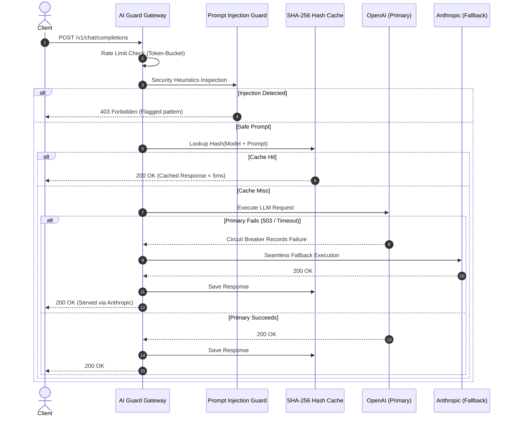

# AI Guard Gateway — Enterprise LLM Security Proxy & Fallback Router

[](https://www.typescriptlang.org/)
[](https://opensource.org/licenses/MIT)
[](https://owasp.org/www-project-top-10-for-large-language-model-applications/)

An enterprise-grade reverse proxy and resilience gateway for Large Language Model (LLM) APIs, providing **Prompt Injection Defenses**, **Token-Bucket Rate Limiting**, **Exact-Hash Semantic Caching**, and **Multi-Provider Circuit Breaker Fallbacks**.

---

## Architecture Flow



---

## Key Capabilities

1. **Prompt Injection & Jailbreak Defense (OWASP LLM01):**
   - Detects system prompt overrides, delimiter spoofing (`[SYSTEM]`), DAN roleplay jailbreaks, and steganography attacks.
2. **Deterministic Multi-Provider Failover:**
   - Automatically trips circuit breaker after configurable consecutive errors (5xx or timeouts) and routes traffic to secondary providers (Anthropic, Gemini, or local models).
3. **Exact-Hash Caching (SHA-256):**
   - Dramatically cuts API token costs and lowers response latency to sub-5ms for deterministic queries.
4. **Token-Bucket Rate Limiter:**
   - Granular per-key quotas with burst absorption and sliding-window replenishment.

---

## Quickstart

```bash
git clone https://github.com/builtbyhuy/ai-guard-gateway.git
cd ai-guard-gateway
npm install
npm test
npm run build
```

### Usage Example

```typescript
import { AIGuardGateway } from "@builtbyhuy/ai-guard-gateway";

const gateway = new AIGuardGateway({
  rateLimitCapacity: 50,
  refillRatePerSec: 10,
});

// Register primary and fallback providers
gateway.registerProvider("openai", async (prompt, model) => {
  // Call OpenAI API...
  return "Response from OpenAI";
});

gateway.registerProvider("anthropic", async (prompt, model) => {
  // Call Anthropic API...
  return "Fallback response from Claude";
});

// Execute request with security & resilience
const response = await gateway.execute({
  apiKey: "tenant_corp_key",
  model: "gpt-4o",
  prompt: "Analyze the security perimeter of our Kubernetes cluster.",
});

console.log(`Served by: ${response.providerUsed} (Cached: ${response.cached})`);
```

---

## License
MIT © [Hồ Khắc Huy](https://github.com/builtbyhuy)
